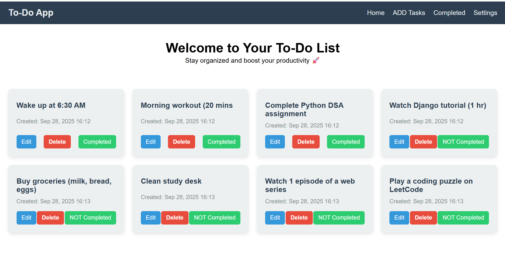
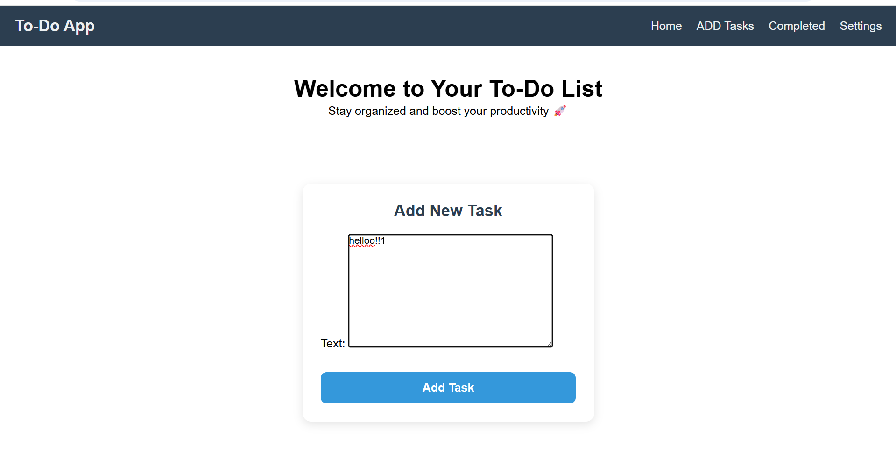
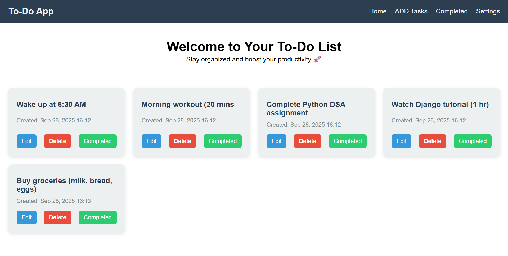

# To-Do List Django App

A simple **To-Do List web application** built with Django that allows users to manage their daily tasks efficiently. Users can add, update, complete, and delete tasks with a clean interface.

---

## Features

- Add new tasks
- Mark tasks as complete
- **Edit existing tasks**
- Delete tasks
- Responsive design for mobile and desktop

---

## Tech Stack

- **Backend:** Python, Django  
- **Frontend:** HTML, CSS, JavaScript  
- **Database:** SQLite (default) / PostgreSQL (optional)  
- **Version Control:** Git & GitHub

---

## Screenshots

### Home Page


### Add Task


### Edit Task


### Task Completed


---

## Installation

1. **Clone the repository**
   ```bash
   git clone https://github.com/your-username/todo-django.git
   cd todo-django
